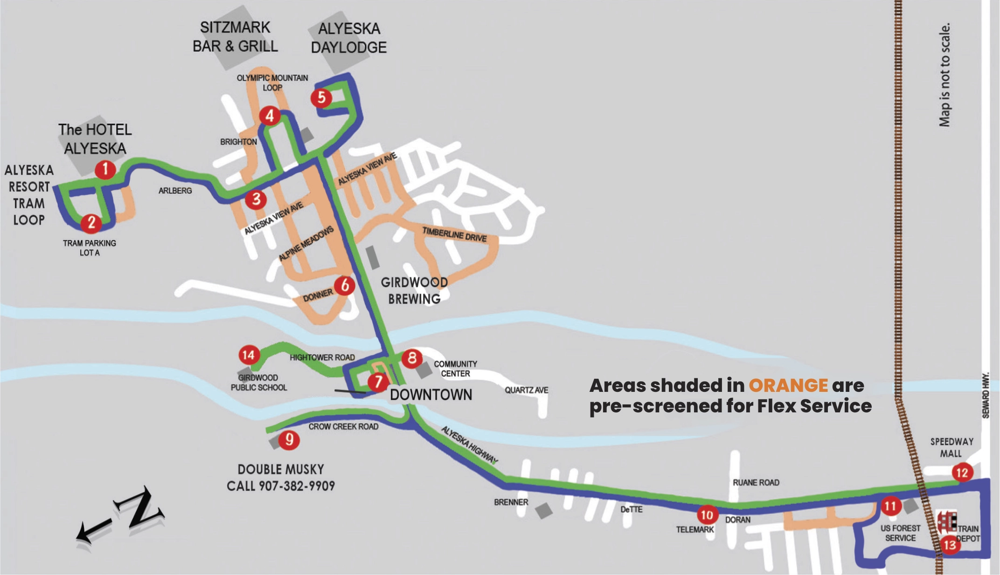

## Overview

**Glacier Valley Transit (GVT)** is Girdwood's public shuttle: free to ride, hourly, roughly 7:30am to 10:30pm, running the main spine of the valley with on-request detours into pre-screened sidestreets (Dawn Johnson, GVT executive director, conversation, 2026-08-01).

Unless noted otherwise, the figures on this page are as Johnson described them in that **August 1, 2026** conversation, and are recalled operating figures rather than audited ones.

About **half its riders are visitors** — per Johnson, a far higher tourist share than the rest of the [[municipality-of-anchorage]]'s transit system — and it runs on about **$500k a year**.

## Service

The fixed route runs from the Alyeska Resort tram loop and the Hotel Alyeska, down through the Alyeska View / Olympic / Alpine Meadows neighborhoods, through downtown Girdwood, and out the Alyeska Highway to the train depot, the US Forest Service office, and the Speedway Mall at the Seward Highway junction. Areas shaded orange on the route map are pre-screened for **Flex Service** — the on-request sidestreet detours.

There is no fare. Riders are asked for a voluntary on-board donation (Johnson, 2026-08-01).

## Funding

Roughly $500k annually, from six sources (Johnson, 2026-08-01):

| Source                                       | Approx. annual |
| -------------------------------------------- | -------------- |
| Federal Transit Administration (FTA)         | $350–400k      |
| [[alyeska-resort]]                           | $57k           |
| On-board donations                           | $20k           |
| Municipal transit budget                     | $20k           |
| Local sponsoring businesses                  | $12k           |
| [[girdwood-service-area]] Parks & Rec budget | $7.5k          |

The FTA money — the majority of the budget — requires GVT to put up **at least $150k** of local match; the non-federal sources in the table count toward it, including the ~$20k in voluntary on-board donations (Johnson, 2026-08-01).

For scale: the MOA's ~$20k contribution compares with a Public Transportation Department direct-cost budget of **$26.4M** in 2022 ([2022 Approved General Government Operating Budget, Public Transportation](https://www.muni.org/Departments/budget/operatingBudget/2022%20GGOB/2022%20Approved/2022%20Approved%20-%20Public%20Transportation.pdf), p. PT-6), i.e. under a tenth of a percent.

## Ridership

Roughly 80,000 rides a year, split about evenly (Johnson, 2026-08-01):

**Visitors — ~40k/yr, about half.** Visitors use it to reach the Hotel Alyeska, bed-and-breakfasts and [[short-term-rentals]], restaurants and local businesses, and — at the highway end of the route — the train depot and the Tesoro/Speedway stop for out-of-town connections.

**Locals — ~40k/yr, about half.** By Johnson's rough estimate about **75% of local trips are essential** economic activity: getting to work, groceries at the Merc, healthcare at the clinic. The remaining ~25% is discretionary or recreational.

## Staffing

On the finances, GVT is breaking even and its funding is not seen as in danger. The constraint is **drivers** (Johnson, 2026-08-01).

- Raising the starting wage over the last several years **has not fixed it**.
- Drivers are [[alyeska-resort]] employees under a lease arrangement — same benefits as resort staff, at a few dollars an hour above the base Alyeska rate. So GVT is not competing on benefits, and is already paying a premium on wage.

### The "down to one bus" account

Six weeks before the Johnson conversation, at the **June 15, 2026** GBOS meeting, public comment from Amanda Tuttle stated that **GVT was down to one bus due to increased operating costs (gas)**, that this was hurting businesses throughout the valley, and that GVT needs more funding ([GBOS minutes, 2026-06-15](../sources/gbos-2026-06-15-minutes.pdf), public comment).

This account attributes the reduced service to operating costs, while Johnson's August account attributes the service constraint to driver staffing and describes the finances as break-even. The two accounts have not been reconciled — see [TODO](#todo).

## Relevance to TIPs

[[tourism-improvement-projects]] money legally must promote tourism, and the Assembly's eligible-use list names **visitor transportation** explicitly ([AM 161-2026, attached to AR 2026-55](../sources/ar-2026-55-tourism-improvement-projects.pdf)).

Johnson raised **TIPs money toward the FTA local match** as a possible ask (Johnson, 2026-08-01). Girdwood's candidate 2027 TIPs projects as of the May 2026 GBOS meeting are a housing study and an RV park feasibility study — see [[tourism-improvement-projects]].

## TODO

- **Resolve the "down to one bus" question directly with Johnson** — is the reduced service a driver shortage, a fuel/operating cost problem, or a fleet/maintenance issue?
- Get GVT's actual budget and ridership documents rather than recalled figures. Is there an annual report, an FTA grant application, or a filing to the muni?
- Which FTA program is the $350–400k from (5311 rural formula? 5307?), and what is the required match ratio? That determines whether $150k is a floor or the whole obligation.
- How many buses does GVT own/operate, and how many drivers does it need vs. have?
- Confirm the ~40k visitor figure's provenance — counted, surveyed, or estimated?
- Get the current Public Transportation Department budget; the $26.4M figure here is 2022.
- What is the lease arrangement with [[alyeska-resort]], and is the $57k contribution contractual or discretionary?

## See also

- [[tourism-improvement-projects]]
- [[girdwood-service-area]]
- [[alyeska-resort]]
- [[girdwood-economics-and-labor-market]]
- [[muni-funds]]
- [[bed-tax]]
